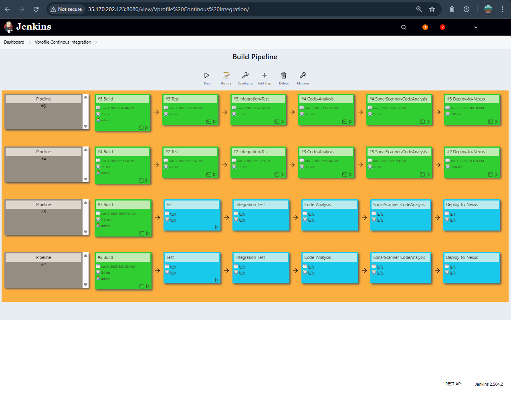
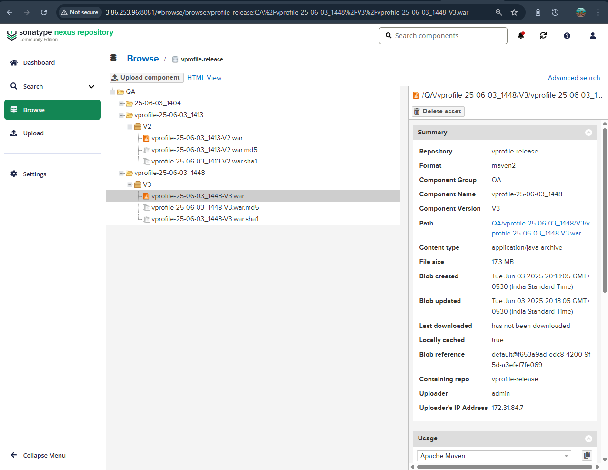
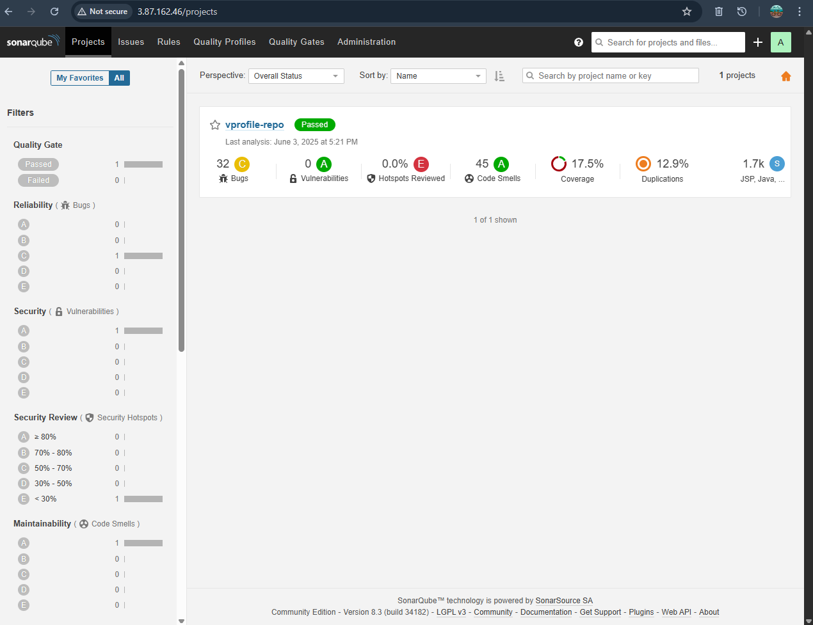
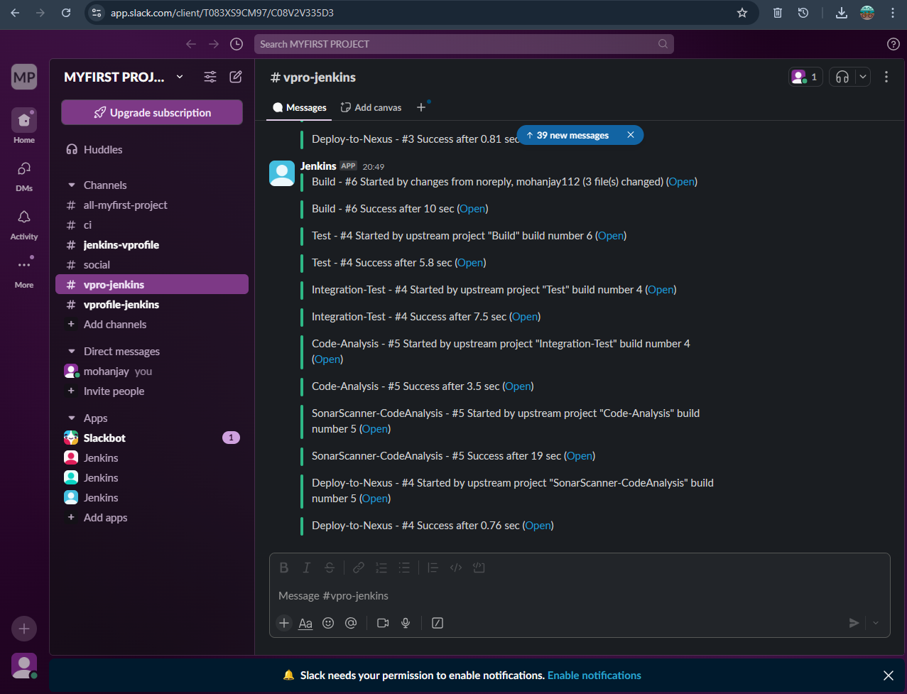
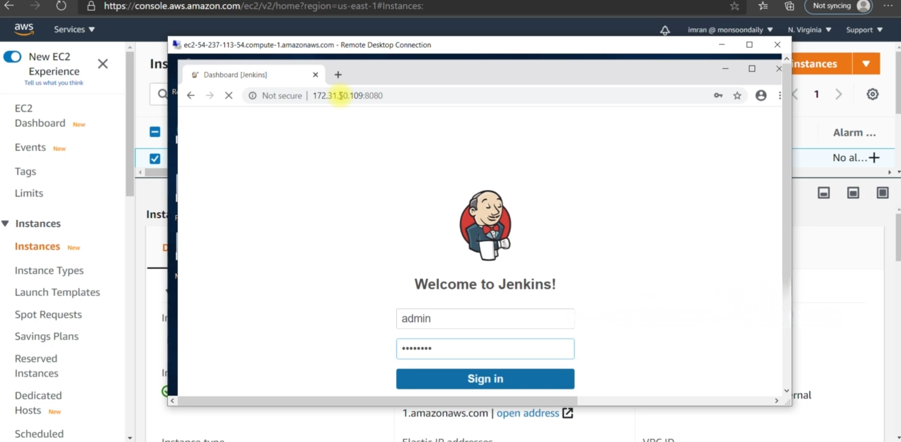
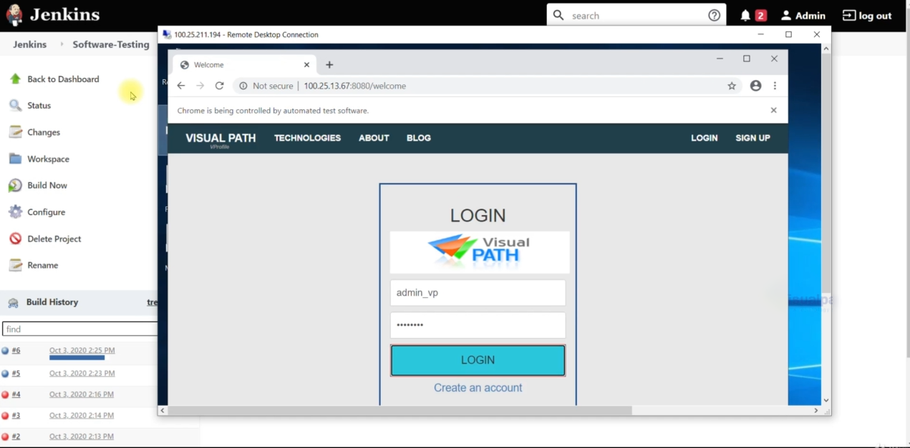

# Java CD Pipeline using Jenkins 

This project demonstrates a complete **Continuous Delivery (CD)** pipeline for a Java web application.

---

#  Project Objectives

- Build Java web app using **Maven**
- Perform **code quality check** using **SonarQube**
- Store build artifacts in **Nexus Repository**
- Run **Selenium test suite** on a **Windows Jenkins slave**
- Deploy `.war` file to **Tomcat server**
- Send real-time **Slack notifications**
- All hosted on **AWS EC2 free-tier** instances

---

# Tools Used

| Tool        | Purpose |
|-------------|---------|
| Jenkins | CI/CD Orchestration |
| Git     | Version Control |
| Maven   | Build Tool |
| SonarQube | Code Quality Analysis |
| Nexus   | Artifact Repository |
| Selenium | Automated Testing |
| Tomcat  | Application Server |
| Slack   | Notification |
| Windows Jenkins Agent** | Execute test suite |
| AWS EC2 | Hosts all tools |

---

#  Pipeline Flow

1. Code pushed to GitHub
2. Jenkins job triggers automatically
3. Code is built using Maven
4. SonarQube scans code quality
5. WAR file is pushed to Nexus
6. Jenkins deploys WAR to Tomcat
7. Selenium tests run on Jenkins slave (Windows)
8. Slack alert sent for success/failure

---

## 📸 Screenshots

### ✅ Jenkins Build

### ✅ Nexus Upload

### ✅ SonarQube Scan

### ✅ Slack Notification

### ✅ Selenium Test Output

### ✅ App Running

